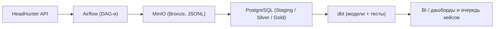

# headhunter-api-explorer

## Обзор проекта

End-to-end Data Engineering пайплайн для сбора и подготовки данных о рынке вакансий  
с акцентом на архитектуру, качество данных и compliance-ориентированные сценарии использования.

## Контакты

- Natalia Tarasova —  Data Engineer / Analytics Engineering — [GitHub](https://github.com/Dia-no-Ace) · [LinkedIn](https://www.linkedin.com/in/natalia-tarasova-39086b3a5)
- Aida Iskakova — Data Engineering / Compliance & KYC Analyst | RegTech | Data-Driven Risk Operations — [GitHub](https://github.com/AidaIsk) · [LinkedIn](https://www.linkedin.com/in/aida-iskakova-5a0b002b3/)

**Поток данных:**

HeadHunter API → Airflow → MinIO (Bronze) → Postgres (Landing / Staging) → dbt (Staging → Silver → Gold) → BI

Проект демонстрирует практический, приближённый к продакшену подход к построению data-платформ:
- слоистая архитектура  
- идемпотентные загрузки  
- наблюдаемость  
- обязательные проверки качества данных  

**Технологический стек:**
- Python  
- Apache Airflow  
- MinIO (S3-совместимое хранилище)  
- Postgres  
- Docker  
- dbt (используется для staging и аналитических слоёв)

---

## Описание проекта

Проект реализует Data Engineering платформу для автоматизированного сбора, хранения  
и подготовки данных о вакансиях из HeadHunter API.

Архитектура построена по принципам, применяемым в реальных data-платформах:
- чёткое разделение ingestion и трансформаций  
- хранение raw-данных как источника истины  
- воспроизводимые и безопасные повторные запуски пайплайнов  

Помимо классической аналитики рынка труда, проект ориентирован на **Compliance и RegTech-кейсы**:
- анализ работодателей  
- анализ отраслей и географии  
- выявление потенциально подозрительных формулировок в описаниях вакансий  

---
## Sanctions Screening Engine Prototype

В проекте реализован prototype-модуль санкционного скрининга, который дополняет HH Compliance Data Platform сценарием проверки имён по санкционным спискам.

### Архитектура санкционного модуля

```text
UN Sanctions XML
      ↓
Airflow DAG (ingestion)
      ↓
bronze.sanctions_raw
      ↓
Python XML parser
      ↓
dbt_staging.stg_unsc__*
      ↓
dbt_staging_silver.sanctions_names
      ↓
dbt_staging_gold.sanctions_fuzzy_matches_best
      ↓
dbt_staging_gold.sanctions_screening_results_demo
```

### Что реализовано

- загрузка санкционного списка UN Security Council;
- хранение raw XML в Bronze-слое;
- парсинг primary names, aliases, nationalities и documents;
- формирование screening-ready таблицы sanctions_names;
- exact matching для точных совпадений;
- fuzzy matching через pg_trgm для поиска похожих имён;
- итоговая demo-витрина sanctions_screening_results_demo с лучшим кандидатом на одно входное имя.

### Логика результата

- MATCH — нормализованное входное имя совпадает с нормализованным именем из санкционного списка;
- POSSIBLE_MATCH — найдено похожее имя, которое требует ручной проверки.

### Пример результата

| input_name | best_match | similarity_score | screening_result |
|---|---|---:|---|
| ADF NALU | ADF/NALU | 1.0000 | MATCH |
| Allied Democrtic Forces | Allied Democratic Forces | 0.8148 | POSSIBLE_MATCH |
| Frank Kakolele Bwambal | FRANK KAKOLELE BWAMBALE | 0.9167 | POSSIBLE_MATCH |

### Что уже умеет модуль

Модуль выполняет полный цикл: от загрузки raw-списка до получения analyst-friendly результата скрининга с exact match, fuzzy candidate search и финальным screening verdict.
___

## Зачем этот проект (business context)

Рынок вакансий — это не только про поиск работы, но и зона повышенного риска:
через вакансии могут маскироваться схемы обхода санкций, обнал и серый гемблинг.

HH Compliance Data Platform задуман как инструмент для:
- автоматического отбора высокорисковых вакансий (crypto / gambling / payments и др.),
- сокращения ручного скрининга для комплаенс-аналитика,
- подготовки данных к санкционному и поведенческому анализу работодателей.

---

## Архитектура пайплайна

```text
HeadHunter API
      ↓
Airflow (DAG-и ingestion)
      ↓
MinIO (Bronze слой, JSONL, партиционирование по дате)
      ↓
Airflow (загрузка и проверки)
      ↓
Postgres (Landing / Staging)
      ↓
dbt (Staging → Silver → Gold)
      ↓
BI / дашборды
```

---

## Архитектура (схема потока данных)



---

## Архитектурные принципы

- Bronze слой — **source of truth**
- Raw-данные не модифицируются после загрузки
- Ingestion строго отделён от трансформаций
- Daily-загрузки отделены от init / backfill
- Все пайплайны идемпотентны
- Контроль покрытия и качества данных обязателен
- Обогащённые записи self-contained и трассируемы

---

## Architecture & Ownership

Проект спроектирован как production-like платформа данных
с чётким разделением ответственности между ingestion,
технической нормализацией и аналитическим моделированием.

Архитектура построена по принципу Medallion:
Bronze → Staging → Silver → Gold.

### Архитектура верхнего уровня

• Source of Truth:
  - MinIO используется для хранения неизменяемого Bronze-слоя (raw JSONL)
  - PostgreSQL применяется как Landing-слой и аналитическое хранилище

• Оркестрация:
  - Airflow отвечает исключительно за оркестрацию пайплайнов
  - Логика ingestion строго отделена от трансформаций

• Трансформации:
  - dbt используется только для детерминированных трансформаций данных
  - dbt не участвует в процессе ingestion

---

### Зоны ответственности

**Aida Iskakova — Architecture / Data Engineering / Compliance**

- Архитектура ingestion: проектирование end-to-end потока данных и стратегии слоёв (Medallion Architecture).
- Data Quality & Observability: логика manifest-based ingestion (Expected vs Loaded), Coverage Reports и severity (OK / WARNING / CRITICAL).
- Compliance Design (Logic Owner): постановка требований к данным, проектирование и формализация риск-сигналов и «серых зон».
- Staging & Contracts: формирование технических контрактов входных данных и полная ответственность за staging-слой (техническая нормализация без бизнес-логики).

**Natalia Tarasova — Analytics Engineering / Monitoring**

- DWH Implementation: загрузка данных из MinIO в Postgres и физическое моделирование слоёв данных.
- dbt Development: реализация риск-флагов и трансформаций в слоях Silver и Gold на основе ТЗ в dbt.
- Business Intelligence: построение аналитических витрин и дашбордов для мониторинга рынка вакансий и качества данных.
- Operations & Monitoring: настройка системы алертинга и операционного мониторинга стабильности пайплайнов.

---

## Orchestration & Reliability (Airflow)

Оркестрация пайплайнов построена на принципе явных зависимостей между DAG
и контролируемых failure-сценариев, без неявных предположений
о наличии данных.

### Dependency-driven orchestration

Основной ingestion DAG (`aida_hh_daily_json`) отвечает за:
- сбор raw-данных из HeadHunter API
- формирование manifest ID (контракт ожидаемых данных)

После успешного формирования manifest основной DAG
явно триггерит enrichment DAG (`aida_hh_details_daily`)
с использованием `TriggerDagRunOperator`.

Такой подход обеспечивает:
- запуск enrichment строго после готовности входных данных
- отсутствие зависимости от расписания downstream-DAG’ов
- исключение race conditions между слоями пайплайна

### Smart SKIP и failure semantics

Enrichment DAG начинается с guard-задачи, проверяющей наличие
manifest-файла в MinIO за конкретную дату загрузки.

Если manifest отсутствует:
- enrichment-задачи не выполняются
- DAG корректно завершается со статусом `SKIPPED`
  (через `AirflowSkipException`)
- ложные ошибки и алерты исключаются

Такое поведение позволяет:
- отличать отсутствие данных от реальных ошибок
- безопасно выполнять backfill и recovery-запуски
- поддерживать чистую и интерпретируемую observability

Оркестрация спроектирована таким образом, чтобы система
оставалась устойчивой и предсказуемой даже при неполных
или отсутствующих данных.

___

## Загрузка данных из HeadHunter API
### Список вакансий
На первом этапе формируются списки вакансий на основе search-профилей.
Эти датасеты используются как **manifest** для последующего обогащения и задают
ожидаемый объём данных для каждой загрузки.

## Поисковые профили (Search Profiles)

Сбор данных переведен с широкого поиска по профессиям на **Risk-Based Approach (RBA)**. Это позволило сфокусировать систему на 100% подозрительных кейсах и снизить объем «шума» с 20 000 до ~1 000 вакансий в день.

### Реализованные риск-профили:
- **P1_payments**: Платежные системы, эквайринг и процессинг.
- **P2_crypto**: Криптовалюты, P2P-обмен и арбитраж.
- **P3_gambling**: Азартные игры, казино и беттинг.
- **P4_grey_schemes**: Серые схемы занятости и сомнительное посредничество.
- **P5_scam_baits**: Вакансии-приманки и потенциальный фрод.

### Преимущества архитектуры:
- **Explainability (Объяснимость)**: Каждая запись в слое Bronze содержит метаданные о причине попадания в систему (`why`) и ожидаемой категории риска (`expected_risk_category`).
- **Decoupling (Разделение)**: Логика поиска полностью вынесена в `configs/search_profiles.yaml`. Это позволяет комплаенс-аналитику менять стратегию сбора данных без правки кода Airflow.
- **Auditability**: Система фиксирует не просто текст вакансии, а контекст (Rationale), в котором она была найдена.

### Детали вакансий (реализовано)
Для каждого vacancy_id выполняется запрос к эндпоинту:

```text
/vacancies/{id}
```
После чего данные сохраняются отдельным Bronze-датасетом.

### Загружаемые атрибуты включают:

- полное описание вакансии
- ключевые навыки
- профессиональные роли и специализации
- адрес, метро и географические координаты (при наличии)
- расширенные данные работодателя
- поведенческие маркеры (premium, тесты, требования к отклику)
- временные метки жизненного цикла вакансии (created, published, archived)

Детали вакансий хранятся отдельно от списков, формируя обогащённый Bronze-слой,
пригодный для текстового анализа, compliance-проверок и downstream-трансформаций.

---

## Качество данных и наблюдаемость
### Реализовано
- Проверка **expected vs loaded** (покрытие данных)
- Логирование на уровне батчей
- Классификация HTTP-ошибок:
  - not_found (404)
  - rate_limited (429)
  - http_error
  - request_exception
  - json_decode_error
- Отдельный Bronze-датасет с ошибочными записями
- Определение severity каждого прогона: OK, WARNING, CRITICAL
- Telegram-алерты по статусу DAG и метрикам покрытия
- Разделение технических ошибок (FAILED) и бизнес-инцидентов (CRITICAL coverage при SUCCESS)
- Идемпотентная логика загрузки с безопасным повторным запуском

### Пример логов:

```text
[batch 007] ok=199 failed=1 status_counts={404: 1}
[TOTAL] expected=2803 ok=2793 failed=10 severity=WARNING
```
##  Airflow DAG-и
| DAG | Тип запуска | Назначение |
|-----|------------|------------|
| `aida_hh_init_bronze_json` | manual | Первичная загрузка и backfill вакансий |
| `aida_hh_daily_json` | scheduled (daily) | Инкрементальная загрузка списков вакансий |
| `aida_hh_details_daily` | scheduled (daily) | Загрузка и обогащение деталей вакансий |
| `nataliia_hh_to_postgres` | scheduled (daily) | Перенос Bronze-данных в Postgres |
| `sanctions_load` | planned | Загрузка санкционных списков |
| `dbt_transform_run` | planned | dbt-модели Silver / Gold и тесты |

---

##  Структура репозитория
```text
## Структура репозитория

.
├── configs/
│   └── search_profiles.yaml        # Конфигурация поисковых профилей (data-driven ingestion)
│
├── dags/
│   ├── aida_hh_init.py             # Инициализация (init / backfill сценарии)
│   ├── aida_hh_daily_dag.py        # Daily DAG: сбор списка вакансий (IDs)
│   ├── aida_hh_details_daily_dag.py# Daily DAG: enrichment вакансий (details)
│   ├── natalia_hh_postgres_dag.py  # Загрузка Bronze → Postgres (Landing / Staging)
│   ├── natalia_hh_details_postgres_dag.py # Загрузка деталей в Postgres
│   ├── natalia_hh_silver_layer_dag.py     # dbt-преобразования Silver
│   ├── natalia_hh_gold_layer_dag.py       # Построение витрин Gold
│   └── test_dag.py                 # Тестовый / экспериментальный DAG
│
├── dbt/
│   └── hh_compliance_dbt/          # dbt проект для трансформаций
│       └── models/
│           ├── staging/            # Техническая нормализация (contracts)
│           ├── silver/             # Бизнес-сущности
│           └── gold/               # Аналитические витрины
│
├── docs/
│   └── architecture/
│       └── risk_signals_contract.md # Каноническая модель риск-сигналов (v1) 
│
├── utils/                          # Общие утилиты и логика
│   ├── aida_hh_api.py              # Работа с HH API (requests, rate limits) 
│   ├── aida_hh_minio.py            # Клиенты и операции с MinIO 
│   ├── hh_ids.py                   # Формирование manifest (vacancy IDs) 
│   ├── hh_details.py               # Enrichment + coverage / failure tracking 
│   ├── search_profiles.py          # Загрузка и обработка search_profiles.yaml
│   ├── natalia_hh_postgres.py      # Логика загрузки данных в Postgres 
│   ├── hh_loader_s3.py             # Загрузчик данных в MinIO (Natalia) 
│   ├── ddl_pg_bronze.sql           # Схема таблиц для вакансий (SQL) 
│   └── ddl_pg_bronze_details.sql   # Схема таблиц для деталей (SQL) 
│
├── legacy/                         # Устаревшие файлы и архивы 
├── Dockerfile                      # Образ Airflow
├── docker-compose.yml              # Описание инфраструктуры
├── .env.example                    # Шаблон переменных окружения
└── README.md
```

dbt-часть проекта вынесена в отдельную директорию и логически отделена от ingestion-кода, что отражает разделение ответственности между сбором данных и аналитическим моделированием.

## Команда проекта

Проект реализуется в формате командной разработкии с чётко зафиксированными зонами архитектурной и аналитической ответственности.

Подробное разделение ролей, архитектурных обязанностей и контрактов между слоями описано в разделе **Architecture & Ownership**.

---

## Compliance-слой и очередь кейсов (Gold)

Текущая цель развития проекта — перейти от «наборов флагов» к
операционной очереди кейсов для комплаенс-команды.

Планируется витрина `gold.compliance_case_queue`, где:

- 1 строка = 1 кейс по вакансии;
- есть тип кейса (`risk_case_type`, например: POTENTIAL_SANCTIONS, ANONYMOUS_EMPLOYER, UNUSUAL_COMPENSATION);
- есть приоритет действия (`action_type`: REVIEW_LIGHT / REVIEW_PRIORITY / BLOCK_ESCALATE);
- хранится список сработавших сигналов и короткое объяснение (`evidence_summary`);
- задан чек-лист для аналитика (`what_to_check`), который подсказывает, что именно проверить.

На основе этой витрины будут строиться:
- рабочая очередь для комплаенс-аналитиков (Metabase / BI),
- дашборды Daily Overview (risk split, coverage) и Case Queue.

---

## Roadmap
- Загрузка санкционных списков (UN SC, US OFAC, затем EU)
- dbt-модели Silver и Gold (включая gold.vacancy_risk_signals и gold.compliance_case_queue)
- Compliance-ориентированные витрины данных
- BI-дашборды Compliance (Daily Overview, Case Queue, Signals & Trends)
- Расширенные проверки качества данных через dbt

---

## Итог
Проект демонстрирует системный и приближённый к продакшену подход
к построению Data Engineering платформы с акцентом на архитектуру,
надёжность и качество данных.

Репозиторий отражает практики командной разработки, наблюдаемость пайплайнов
и готовность данных к аналитическим и compliance-сценариям использования.
